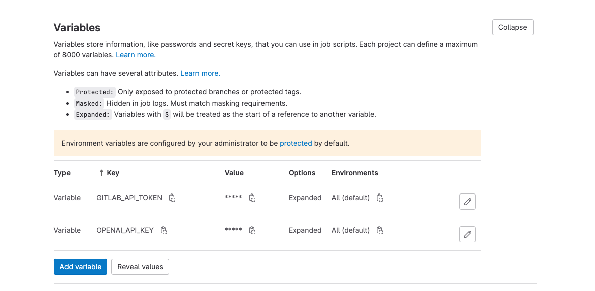
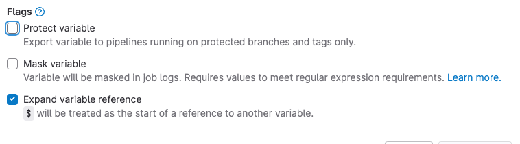

# code_review_chat_gpt

chat gpt pr 요청시 코드리뷰 시키기 gitlab, github 각각의 플래폼에서 실행

1. ### chat-gpt api 키 발급

   - https://platform.openai.com/account/api-keys

2. ### gitlab api token 발급

   - https://gitlab.com/-/profile/personal_access_tokens

3. ### variables 등록

   - 
   - 

4. ### .gitlab-ci.yml or github workflow파일 작성

5. ### code_review.js 파일을 src 파일과 같은 위치에 작성

6. ### merge-request or pull-request 작성
